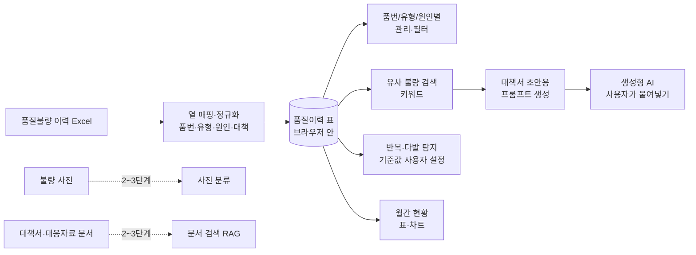

# AI 기반 품질불량 자동 분석 시스템 — 프로젝트 기획서

| 항목 | 내용 |
|---|---|
| 리포 | data09-17 |
| 제출자 | 안지혁 |
| 직무·소속 | 품질팀 / 천일테크윈 |
| 과정 | 현장 데이터 디지털화 전문가과정 1차수 |
| 작성일 | 2026-09-28 |
| 문서 상태 | 초안 v0.2 — 수강생 제출 자료 기반, 2026-09-29 수강생 질문(다음 단계 진행 방법)과 답 반영(11장) |

---

## 1. 추진 배경과 현안

- 현장에서 품질이슈가 발생하면 불량현상, 발생원인, 개선대책을 수작업으로 작성하고 있습니다.
- 과거 유사 불량과 개선 이력을 찾는 데에도 많은 시간이 들고 있습니다.
- 불량 발생 시 불량현상 정리 → 원인 분석 → 개선대책 작성 → 유사 불량 이력 검색 → 품질보고서 작성까지를 지원하는 시스템이 필요합니다.
- 이를 통해 품질이슈 대응시간을 줄이고, 과거 품질이력과 개선대책을 활용해 동일·유사 불량의 재발을 막고자 합니다.

품질불량 이력은 Excel로 관리되고 있고, 개선대책서·고객사 대응자료는 문서 파일로 흩어져 있는 것으로 보입니다(가정). 그래서 과거 사례를 찾으려면 파일을 하나씩 열어 보아야 하는 상황으로 보입니다(가정).

## 2. 목표

### 2.1 최종 목표

- 품질불량 데이터를 한곳에 모아 **품번·불량유형·원인별로 관리**하고, 새 불량이 생기면 **과거 유사 불량과 개선사례를 바로 찾아 주는** 시스템
- 불량현상·발생원인·개선대책·재발방지대책 **작성을 AI가 초안으로 지원**
- **반복·다발 불량 자동 탐지**와 **월간 품질불량 현황·KPI 보고서 자동 생성**
- 불량 사진과 입력 정보를 바탕으로 한 불량 **자동 분류** (장기)

### 2.2 1차 개발 목표

제출된 기대 산출물은 범위가 넓어, 1차는 **지금 가진 Excel 이력만으로 바로 쓸 수 있는 브라우저 도구**에 집중합니다.

- 품질불량 이력 Excel을 가져와(열 매핑) 품번·불량유형·원인별로 관리·필터
- 키워드 기반 유사 불량 검색
- 반복·다발 불량 탐지 규칙(기준값은 사용자가 설정)
- 월간 불량 현황 표·차트
- 불량현상·원인·대책서 초안은 **과거 이력을 붙인 프롬프트를 만들어 생성형 AI에 넣는 반자동 방식**으로 지원

사진 자동 분류와 문서 기반 검색(RAG)은 데이터 정리가 끝난 뒤 2~3단계에서 다룹니다.

## 3. 보유 데이터

| 데이터 | 형태 | 규모·주기 | 비고(민감도 등) |
|---|---|---|---|
| 품질불량 이력 | Excel로 가정 | 건수·기간 미상 | 사내 품질 정보. 열 구성 미상(발생일, 품번, 품명, 불량유형, 불량현상, 원인, 대책, 수량, 공정, 고객사 등이 있을 것으로 가정) |
| 불량 현상 및 불량 사진 | 이미지 파일 + 설명 글 | 미상 | 이력과 사진을 잇는 키(관리번호 등)가 있는지 미상 |
| 품질 개선대책서·재발방지대책 | 문서(한글·Word·Excel·PDF 중 하나로 가정) | 미상 | 양식 통일 여부 미상 |
| 고객사 품질이슈 대응자료 | 문서로 가정 | 미상 | 고객사 정보 포함 — 외부 반출 주의 |
| 품질 관련 Excel 관리자료 | Excel | 미상 | 이력과 별개 파일인지, 같은 내용인지 미상 |

제출 원문에 첨부 파일은 없습니다. 이력 Excel 샘플이 있어야 열 매핑과 분류 기준을 확정할 수 있습니다(10장).

## 4. 해결 방안 개요

| 단계 | 내용 |
|---|---|
| 수집 | 품질불량 이력 Excel (이후 사진, 대책서, 고객사 대응자료) |
| 정리 | 열 매핑으로 공통 항목(발생일·품번·불량유형·현상·원인·대책 등)에 맞추고, 불량유형·원인 표기 흔들림을 대표 이름으로 묶음 |
| 분석 | 품번·유형·원인별 집계, 기간 내 반복 발생 탐지, 월별 추이, 키워드 유사도 검색 |
| AI | 새 불량 내용 + 유사 과거 이력을 묶은 프롬프트로 현상·원인·대책 초안 작성 (1단계는 반자동) |
| 산출물 | 품질이력 관리 화면, 유사 불량 검색 결과, 반복·다발 불량 목록, 월간 현황 보고, 대책서 초안 |

## 5. 주요 기능

| 기능 | 설명 | 우선순위 |
|---|---|---|
| 이력 Excel 가져오기 | 품질불량 이력 Excel을 읽어 공통 항목으로 변환. 파일마다 열 이름이 다를 수 있어 열 매핑 화면 제공, 매핑은 저장해 다음에 재사용 | MVP |
| 품번/불량유형/원인별 관리·필터 | 기간·품번·불량유형·원인·공정·고객사로 걸러 보기, 건수·수량 집계 | MVP |
| 분류 표기 정리 | 같은 불량유형·원인이 다르게 적힌 경우(띄어쓰기·약어 등) 대표 이름으로 묶는 사전 | MVP |
| 유사 불량 검색 | 새 불량 내용(현상·품번·키워드)을 넣으면 과거 이력 중 겹치는 낱말이 많은 순으로 보여 주고, 당시 원인·대책을 함께 표시 | MVP |
| 반복·다발 불량 탐지 | 「같은 품번·같은 유형이 N일 안에 M건 이상」 같은 규칙으로 표시. N·M 등 기준값은 사용자가 설정 | MVP |
| 월간 현황 | 월별 건수·수량, 유형별·품번별 상위 목록을 표와 차트로 표시, Excel·인쇄용 화면 내보내기 | MVP |
| 대책서 초안 프롬프트 생성 | 새 불량 정보 + 유사 과거 이력(원인·대책)을 붙여 불량현상·원인·개선대책·재발방지대책 초안을 요청하는 프롬프트를 만들어 복사. 사용자가 사내 허용 AI에 붙여넣음 | MVP(반자동) |
| KPI 보고서 | 사내 KPI 정의(불량률 등)가 확정되면 월간 보고서에 지표로 추가 | 확장(정의 확보 후) |
| 반복·다발 알림 | 탐지 결과를 담당자에게 메일·메신저로 알림 | 확장 |
| 대책서·대응자료 문서 검색(RAG) | 개선대책서·재발방지대책·고객사 대응자료를 근거로 원인·대책 질의 | 확장 |
| 불량 사진 기반 현상 작성·분류 | 사진과 입력 정보로 불량현상 문장 초안 작성, 불량유형 자동 분류 | 확장 |
| AI 자동 분류 | 불량 설명 글로 불량유형·원인 분류를 제안 | 확장 |

## 6. 기대 산출물

1. **품질불량 이력 관리 도구(브라우저)** — Excel 가져오기, 품번·유형·원인별 관리·필터
2. **유사 불량 검색** — 과거 원인·대책을 함께 보여 주는 검색 결과
3. **반복·다발 불량 목록** — 사용자가 정한 기준으로 탐지
4. **월간 품질불량 현황 보고** — 표·차트, Excel 내보내기 (KPI는 정의 확보 후)
5. **대책서 초안 작성 프롬프트** — 불량현상·발생원인·개선대책·재발방지대책 초안용
6. **문서 기반 질의 챗봇·사진 분류** — 2~3단계 (확장)

## 7. 기술 구성

| 과정 도구 | 이 프로젝트에서 쓰는 곳 |
|---|---|
| DAY1 암묵지 자산화·전략기획 | 품질 담당자가 원인을 판단하는 기준, 불량유형·원인 분류 체계, 「반복 불량」으로 보는 기준을 꺼내 적기 |
| DAY2 코랩(Python)·바이브코딩 | 이력 Excel 정리, 표기 흔들림 묶기, 집계·반복 탐지 로직 시험, 브라우저 도구 제작 — 1단계의 중심 |
| DAY3 멀티모달 비정형 정보화 | 불량 사진 설명, 문서 형태 대책서에서 항목(현상·원인·대책) 뽑아 표로 만들기 (2단계) |
| DAY4 RAG (Dify, NotebookLM) | 개선대책서·재발방지대책·고객사 대응자료를 근거로 한 원인·대책 질의 (2~3단계) |
| DAY5 Make 자동화 | 반복·다발 불량 알림, 월간 보고서 정기 발송 (확장, 보안 허용 시) |
| 생성형 AI | 불량현상·원인·대책서 초안 작성 (1단계는 프롬프트 생성 반자동) |

**개발 형태(권장)**

- 1단계는 **설치 없이 브라우저에서 도는 정적 웹 도구**로 만듭니다. Excel을 브라우저 안에서만 읽고 계산하므로 **품질 이력과 고객사 정보가 외부로 나가지 않습니다.** 관리·검색·탐지·집계는 규칙 계산이라 AI 서비스가 필요 없습니다.
- 대책서 초안은 도구가 AI를 직접 부르지 않고 **프롬프트만 만들어 복사**하게 합니다. 사내에서 허용된 AI에만 붙여넣도록 하면 외부 AI 사용 규정과 부딪히지 않습니다(외부 AI 사용 허용 여부는 10장에서 확인).
- 여러 사람이 같은 이력을 함께 쓰려면 공유 저장소가 필요합니다. 1단계는 파일 단위로 쓰고, 공유 방식은 사내 환경을 확인한 뒤 정합니다(가정).

## 8. 개발 단계

### 1단계 — 지금 바로 개발 가능한 부분

사진·문서가 없어도 **품질불량 이력 Excel 하나만 있으면** 쓸 수 있는 기능을 먼저 만듭니다. 샘플을 받기 전에는 가상의 이력 데이터로 만들고, 샘플을 받으면 열 매핑만 맞춥니다.

- 이력 Excel 가져오기(열 매핑 화면, 매핑 저장)
- 품번/불량유형/원인별 관리·필터와 건수·수량 집계
- 불량유형·원인 표기 묶음 사전
- 키워드 기반 유사 불량 검색(과거 원인·대책 함께 표시)
- 반복·다발 불량 탐지 규칙(기간·건수 기준값 사용자 설정)
- 월간 현황 표·차트, Excel 내보내기
- 불량현상·원인·대책서 초안용 프롬프트 생성(과거 유사 이력 자동 첨부, 복사 버튼)
- 시험용 가상 데이터에는 일부러 같은 품번·유형의 반복 불량과 표기가 다른 같은 원인을 넣어, 탐지와 묶음이 제대로 되는지 확인합니다.

### 2단계

- 실제 이력 Excel로 열 매핑·분류 사전 보정
- KPI 정의 확정 후 월간 KPI 보고서
- 개선대책서·재발방지대책 문서에서 현상·원인·대책 항목을 뽑아 이력과 합치기
- 대책서·고객사 대응자료 기반 문서 질의(Dify 또는 NotebookLM)
- 반복·다발 불량 알림(Make)

### 3단계

- 불량 사진과 입력 정보로 불량현상 문장 초안 작성
- 사진·설명 기반 불량유형 자동 분류(분류 체계와 사진-이력 연결 키 확보 후)
- 사내 허용 AI와 직접 연결해 대책서 초안 자동 작성, 여러 사용자가 함께 쓰는 공유 저장소

## 9. 기대 효과

- **유사 불량 검색 시간 단축** — 파일을 하나씩 열지 않고 과거 이력과 당시 대책을 한 번에 찾습니다.
- **재발 방지** — 반복·다발 불량을 기준에 따라 빠짐없이 드러내 조기에 대응할 수 있습니다.
- **대책서 작성 부담 감소** — 과거 대책을 붙인 초안에서 시작해 작성 시간을 줄입니다.
- **보고 기준 일관화** — 월간 현황을 같은 분류 기준으로 매달 같은 형식으로 냅니다.

제출 자료에는 정량 수치가 없어 이 문서도 수치를 적지 않습니다.

## 10. 확인 필요 사항

**샘플 데이터 (필수)**

1. 품질불량 이력 Excel 샘플 — 열 구성(발생일, 품번, 품명, 불량유형, 불량현상, 원인, 대책, 수량, 공정, 고객사, 관리번호 등), 시트 구성, 한 행이 불량 1건인지
2. 이력 건수와 기간(대략 몇 년치, 몇 건인지)
3. 개선대책서·재발방지대책 샘플 1~2건과 파일 형식(한글·Word·Excel·PDF)
4. 「품질 관련 Excel 관리자료」가 이력과 다른 파일이라면 무엇을 관리하는 파일인지

**분류·판정 기준**

5. 현재 쓰는 불량유형·원인 분류 체계(코드표가 있는지, 자유 기재인지)
6. 「반복·다발 불량」으로 보는 기준(기간, 건수, 같은 품번만인지 같은 유형 전체인지)
7. 월간 보고서에 들어가는 KPI 항목과 계산식(불량률의 분모 — 생산 수량 자료가 있는지 등), 기존 월간 보고서 양식
8. 불량 사진과 이력을 잇는 키(관리번호 등)가 있는지, 사진 보관 위치

**보안·환경**

9. 품질 이력·고객사 대응자료를 외부 AI(ChatGPT 등)나 클라우드(코랩 포함)에 올려도 되는지, 사내에서 허용된 AI가 있는지
10. 도구를 혼자 쓰는지, 품질팀이 함께 쓰는지(공유 저장소 필요 여부)

## 11. 2026-09-29 수강생 질문 — 다음 단계로 넘어가려면

### 11.1 질문 원문

> 다음단계로 넘어가려고 하는데 어떻게하나요 ?

패들릿 게시물·댓글(2026-09-29T05:31Z, 05:38Z, 같은 문장). 원문은 `docs/source/2026-09-29_패들릿_질문.md`.

### 11.2 답 — 진행 방법

2단계는 **받은 자료에 맞춰** 만듭니다. 1단계 도구는 가정한 열 구성과 가상 데이터로 만들었기 때문에, 실제 이력으로 한 번 써 보고 안 맞는 점을 알려 주시는 것이 다음 단계의 출발점입니다.

**1) 지금 1단계 도구로 해 볼 것**

1. 실제 품질불량 이력 Excel 을 「Excel·CSV 불러오기」로 엽니다. 회사 밖으로 내기 어려운 값(품번·고객사·담당자 이름)은 사본에서 「A사」「품번1」처럼 바꿔도 됩니다. 도구는 파일을 서버로 보내지 않고 브라우저 안에서만 계산합니다.
2. 「열 맞추기」에서 파일 열을 표준 항목에 연결합니다. 연결할 곳이 없던 열, 읽지 못한 날짜·수량을 적어 둡니다.
3. 「유사 불량」「반복·다발」「월간 현황」「대책서 초안」을 실제 이력으로 써 봅니다. 찾고 싶은 사례가 안 나온 검색어, 기준이 맞지 않던 반복 탐지를 적어 둡니다.
4. 안 맞은 점을 패들릿 댓글로 알려 줍니다.

**2) 보내 주실 것 (2단계 준비 목록)**

| 항목 | 내용 | 쓰는 곳 |
|---|---|---|
| 10장 질문 답 | 10개 질문(열·시트 구성, 건수·기간, 대책서 형식, 관리자료, 분류 체계, 반복 기준, KPI, 사진 연결 키, 외부 AI 허용, 공유 여부) | 전부 |
| 이력 샘플 | 값을 가린 Excel 10~20행, 어려우면 열 이름 목록만. 도구 「다음 단계 → 요약 글 만들기」가 열 이름·건수·기간·불량유형 이름·검사 결과만 모은 글을 만듭니다(품번·고객사·원인·대책 값은 넣지 않음) | 열 맞추기·표기 사전 보정 |
| 불량 사진 | 불량유형 이름으로 폴더를 나눠 유형마다 20장 이상(가능하면 50장), 정상품 사진도. 3~5개 유형부터 시작 가능. 파일 이름에 관리번호. 반출이 어려우면 유형별 장수와 보관 위치만 | 사진으로 현상 쓰기·분류 |
| 문서 | 개선대책서·재발방지대책 3~5건(고객사·이름 가림)과 형식, 검사기준서·작업표준서 등 사내 표준 목록. 고객사 대응자료는 반출 가능 여부 먼저 | 대책서 항목 뽑기·문서 근거 질의(RAG) |

**3) 2단계에서 만드는 것 — 순서**

1. **실제 이력에 맞추기** — 받은 열 구성으로 열 맞추기 자동 추천, 분류 코드표로 표기 사전, 품질팀 기준으로 반복·다발 기준·유사 검색 점수 보정. 자료를 받는 대로 바로 합니다.
2. **대책서에서 항목 뽑기** — 개선대책서·재발방지대책에서 불량현상·발생원인·개선대책·재발방지대책을 뽑아 이력에 합치고, 유사 불량 검색에 문서 내용도 걸리게 합니다(DAY3).
3. **문서 근거 질의(RAG)** — 대책서·사내 표준을 근거로 과거 원인·대책을 묻고 답에 근거 문서를 붙입니다. 10장 9번(외부 AI 허용) 답에 따라 NotebookLM·Dify 또는 사내 허용 AI 로 정합니다(DAY4).
4. **사진으로 현상 쓰기** — 사진을 AI 에 보여 주고 불량현상 문장 초안을 받는 반자동 화면부터. 유형별 사진이 충분히 모이면 불량유형 자동 분류로 넓힙니다(8장 3단계 항목을 사진이 모이는 대로 앞당김).
5. **KPI·알림** — 불량률 분모(생산 수량)와 KPI 계산식을 받으면 월간 KPI 보고서, 보안이 허용되면 반복·다발 알림(Make).

사진 분류와 RAG 는 자료가 있어야 시작할 수 있어, 사진·문서는 지금부터 모아 두시는 것이 가장 빠른 길입니다.

### 11.3 도구에 반영한 것

- 홈(품질 이력) 화면에 「다음 단계로 가려면」 안내 상자, 메뉴에 「다음 단계」 화면 추가 — 위 1)~3)과 체크 목록(이 브라우저에 기억), 10장 질문, 사진·문서 모으는 요령.
- 「요약 글 만들기」 — 불러온 이력의 열 이름·연결 결과·건수·기간·불량유형 이름(표기 정리 적용)·검사 결과와 10장 질문 빈칸을 한 글로 만들어 복사. 품번·품명·고객사·원인·대책 값은 넣지 않습니다(로직 `readinessSummary`, 테스트로 확인).

## 부록. 제출 원문 요약

| 출처 | 파일·게시물 | 내용 |
|---|---|---|
| 패들릿 게시물 1 (2026-09-28T08:24) | 「AI 기반 품질불량 자동 분석 시스템」 — `기획_원문.md` | 직무·소속(품질팀 / 천일테크윈), 현안(불량현상·원인·대책 수작업 작성, 유사 불량 이력 검색 시간 소요), 보유 데이터(품질불량 이력, 불량 현상·사진, 개선대책서·재발방지대책, 고객사 대응자료, 품질 Excel 관리자료), 기대 산출물 9종(자동 분류·분석, 사진 기반 현상 작성, 원인 분석, 유사 사례 검색, 대책 작성 지원, 반복·다발 탐지·알림, 품번/유형/원인별 이력 관리, 월간 현황·KPI 보고서, 대응 업무 자동화) |

첨부 파일은 제출되지 않았습니다(`attachments.json` 비어 있음).
