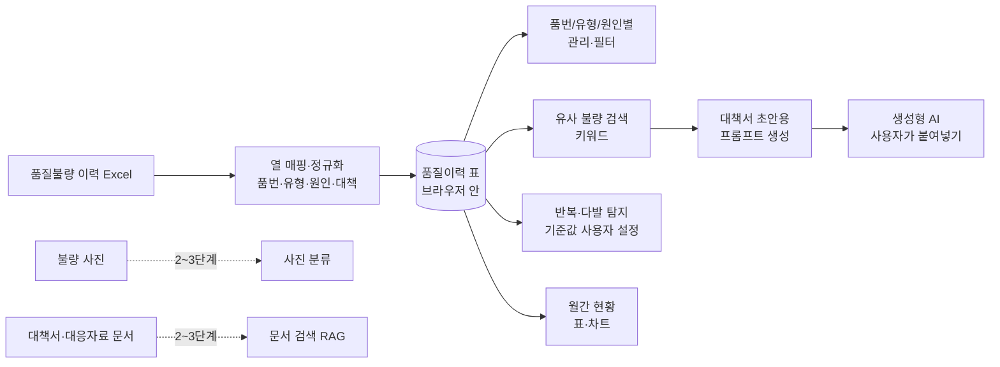

# AI 기반 품질불량 자동 분석 시스템 — 프로젝트 기획서

| 항목 | 내용 |
|---|---|
| 리포 | data09-17 |
| 제출자 | 안지혁 |
| 직무·소속 | 품질팀 / 천일테크윈 |
| 과정 | 현장 데이터 디지털화 전문가과정 1차수 |
| 작성일 | 2026-09-28 |
| 문서 상태 | 초안 v0.6 — 수강생 제출 자료 기반, 2026-09-29 수강생 질문(다음 단계 진행 방법)과 답 반영(11장), 2026-09-30 10장 질문 답·실제 열 구성 확정 반영(12장), 2026-09-30 사진 붙이기 요청 반영(13장), 2026-09-30 최종 요청 — 품질 이력 화면 위 「다음 단계」 안내 빼기(14장), 2026-09-30 디자인 시안 적용 — 왼쪽 메뉴·대시보드(15장) |

---

## 1. 추진 배경과 현안

- 현장에서 품질이슈가 발생하면 불량현상, 발생원인, 개선대책을 수작업으로 작성하고 있습니다.
- 과거 유사 불량과 개선 이력을 찾는 데에도 많은 시간이 들고 있습니다.
- 불량 발생 시 불량현상 정리 → 원인 분석 → 개선대책 작성 → 유사 불량 이력 검색 → 품질보고서 작성까지를 지원하는 시스템이 필요합니다.
- 이를 통해 품질이슈 대응시간을 줄이고, 과거 품질이력과 개선대책을 활용해 동일·유사 불량의 재발을 막고자 합니다.

품질불량 이력은 Excel로 관리되고 있고, 개선대책서·고객사 대응자료는 문서 파일로 흩어져 있는 것으로 보입니다(가정). 그래서 과거 사례를 찾으려면 파일을 하나씩 열어 보아야 하는 상황으로 보입니다(가정).

## 2. 목표

### 2.1 최종 목표

- 품질불량 데이터를 한곳에 모아 **품번·불량유형·원인별로 관리**하고, 새 불량이 생기면 **과거 유사 불량과 개선사례를 바로 찾아 주는** 시스템
- 불량현상·발생원인·개선대책·재발방지대책 **작성을 AI가 초안으로 지원**
- **반복·다발 불량 자동 탐지**와 **월간 품질불량 현황·KPI 보고서 자동 생성**
- 불량 사진과 입력 정보를 바탕으로 한 불량 **자동 분류** (장기)

### 2.2 1차 개발 목표

제출된 기대 산출물은 범위가 넓어, 1차는 **지금 가진 Excel 이력만으로 바로 쓸 수 있는 브라우저 도구**에 집중합니다.

- 품질불량 이력 Excel을 가져와(열 매핑) 품번·불량유형·원인별로 관리·필터
- 키워드 기반 유사 불량 검색
- 반복·다발 불량 탐지 규칙(기준값은 사용자가 설정)
- 월간 불량 현황 표·차트
- 불량현상·원인·대책서 초안은 **과거 이력을 붙인 프롬프트를 만들어 생성형 AI에 넣는 반자동 방식**으로 지원

사진 자동 분류와 문서 기반 검색(RAG)은 데이터 정리가 끝난 뒤 2~3단계에서 다룹니다.

## 3. 보유 데이터

| 데이터 | 형태 | 규모·주기 | 비고(민감도 등) |
|---|---|---|---|
| 품질불량 이력 | Excel (확정) | 최근 3개월 22건 (2026-06-09 ~ 09-17) (확정) | 1행 = 불량 1건 (확정). 열: 하자NO.·발생일·품번·품명·불량내용(=불량유형)·현상 조치&조치 사항·원인분류·발생원인·대책수립 진행결과·완료여부·수량·공정·고객 (확정, 12장) |
| 불량 현상 및 불량 사진 | 이미지 파일 + 설명 글 | 지금은 불량 사진 없음 (확정) | 품번·발생일자·이슈번호로 관리, 사내 파일서버 폴더 보관 (확정) |
| 품질 개선대책서·재발방지대책 | 주로 Excel (확정) | 3건 메일로 받을 예정 | 양식 통일 여부는 받은 뒤 확인 |
| 고객사 품질이슈 대응자료 | 문서로 가정 | 미상 | 고객사 정보 포함 — 외부 반출 주의 |
| 품질 관련 Excel 관리자료 | Excel | 메일로 받을 예정 | 「공정불량 이력 LIST」 — 품질불량 이력과 다른 두 번째 이력 (확정) |

제출 원문에 첨부 파일은 없습니다. 열 구성·건수·분류 방식은 2026-09-30 답으로 확정했습니다(12장). 메일로 받을 불량 LIST·대책서는 회사 자료라 리포에 넣지 않습니다.

## 4. 해결 방안 개요

| 단계 | 내용 |
|---|---|
| 수집 | 품질불량 이력 Excel (이후 사진, 대책서, 고객사 대응자료) |
| 정리 | 열 매핑으로 공통 항목(발생일·품번·불량유형·현상·원인·대책 등)에 맞추고, 불량유형·원인 표기 흔들림을 대표 이름으로 묶음 |
| 분석 | 품번·유형·원인별 집계, 기간 내 반복 발생 탐지, 월별 추이, 키워드 유사도 검색 |
| AI | 새 불량 내용 + 유사 과거 이력을 묶은 프롬프트로 현상·원인·대책 초안 작성 (1단계는 반자동) |
| 산출물 | 품질이력 관리 화면, 유사 불량 검색 결과, 반복·다발 불량 목록, 월간 현황 보고, 대책서 초안 |

## 5. 주요 기능

| 기능 | 설명 | 우선순위 |
|---|---|---|
| 이력 Excel 가져오기 | 품질불량 이력 Excel을 읽어 공통 항목으로 변환. 파일마다 열 이름이 다를 수 있어 열 매핑 화면 제공, 매핑은 저장해 다음에 재사용 | MVP |
| 품번/불량유형/원인별 관리·필터 | 기간·품번·불량유형·원인·공정·고객사로 걸러 보기, 건수·수량 집계 | MVP |
| 분류 표기 정리 | 같은 불량유형·원인이 다르게 적힌 경우(띄어쓰기·약어 등) 대표 이름으로 묶는 사전 | MVP |
| 유사 불량 검색 | 새 불량 내용(현상·품번·키워드)을 넣으면 과거 이력 중 겹치는 낱말이 많은 순으로 보여 주고, 당시 원인·대책을 함께 표시 | MVP |
| 반복·다발 불량 탐지 | 「같은 품번·같은 유형이 N일 안에 M건 이상」 같은 규칙으로 표시. N·M 등 기준값은 사용자가 설정 | MVP |
| 월간 현황 | 월별 건수·수량, 유형별·품번별 상위 목록을 표와 차트로 표시, Excel·인쇄용 화면 내보내기 | MVP |
| 대책서 초안 프롬프트 생성 | 새 불량 정보 + 유사 과거 이력(원인·대책)을 붙여 불량현상·원인·개선대책·재발방지대책 초안을 요청하는 프롬프트를 만들어 복사. 사용자가 사내 허용 AI에 붙여넣음 | MVP(반자동) |
| KPI 보고서 | 만들지 않기로 함(2026-09-30 답, 10장 7번) | 제외 |
| 반복·다발 알림 | 탐지 결과를 담당자에게 메일·메신저로 알림 | 확장 |
| 대책서·대응자료 문서 검색(RAG) | 개선대책서·재발방지대책·고객사 대응자료를 근거로 원인·대책 질의 | 확장 |
| 불량 사진 기반 현상 작성·분류 | 사진과 입력 정보로 불량현상 문장 초안 작성, 불량유형 자동 분류 | 확장 |
| AI 자동 분류 | 불량 설명 글로 불량유형·원인 분류를 제안 | 확장 |

## 6. 기대 산출물

1. **품질불량 이력 관리 도구(브라우저)** — Excel 가져오기, 품번·유형·원인별 관리·필터
2. **유사 불량 검색** — 과거 원인·대책을 함께 보여 주는 검색 결과
3. **반복·다발 불량 목록** — 사용자가 정한 기준으로 탐지
4. **월간 품질불량 현황 보고** — 표·차트, Excel 내보내기 (KPI는 정의 확보 후)
5. **대책서 초안 작성 프롬프트** — 불량현상·발생원인·개선대책·재발방지대책 초안용
6. **문서 기반 질의 챗봇·사진 분류** — 2~3단계 (확장)

## 7. 기술 구성

| 과정 도구 | 이 프로젝트에서 쓰는 곳 |
|---|---|
| DAY1 암묵지 자산화·전략기획 | 품질 담당자가 원인을 판단하는 기준, 불량유형·원인 분류 체계, 「반복 불량」으로 보는 기준을 꺼내 적기 |
| DAY2 코랩(Python)·바이브코딩 | 이력 Excel 정리, 표기 흔들림 묶기, 집계·반복 탐지 로직 시험, 브라우저 도구 제작 — 1단계의 중심 |
| DAY3 멀티모달 비정형 정보화 | 불량 사진 설명, 문서 형태 대책서에서 항목(현상·원인·대책) 뽑아 표로 만들기 (2단계) |
| DAY4 RAG (Dify, NotebookLM) | 개선대책서·재발방지대책·고객사 대응자료를 근거로 한 원인·대책 질의 (2~3단계) |
| DAY5 Make 자동화 | 반복·다발 불량 알림, 월간 보고서 정기 발송 (확장, 보안 허용 시) |
| 생성형 AI | 불량현상·원인·대책서 초안 작성 (1단계는 프롬프트 생성 반자동) |

**개발 형태(권장)**

- 1단계는 **설치 없이 브라우저에서 도는 정적 웹 도구**로 만듭니다. Excel을 브라우저 안에서만 읽고 계산하므로 **품질 이력과 고객사 정보가 외부로 나가지 않습니다.** 관리·검색·탐지·집계는 규칙 계산이라 AI 서비스가 필요 없습니다.
- 대책서 초안은 도구가 AI를 직접 부르지 않고 **프롬프트만 만들어 복사**하게 합니다. 사내에서 허용된 AI에만 붙여넣도록 하면 외부 AI 사용 규정과 부딪히지 않습니다(외부 AI 사용 허용 여부는 10장에서 확인).
- 여러 사람이 같은 이력을 함께 쓰려면 공유 저장소가 필요합니다. 1단계는 파일 단위로 쓰고, 공유 방식은 사내 환경을 확인한 뒤 정합니다(가정).

## 8. 개발 단계

### 1단계 — 지금 바로 개발 가능한 부분

사진·문서가 없어도 **품질불량 이력 Excel 하나만 있으면** 쓸 수 있는 기능을 먼저 만듭니다. 샘플을 받기 전에는 가상의 이력 데이터로 만들고, 샘플을 받으면 열 매핑만 맞춥니다.

- 이력 Excel 가져오기(열 매핑 화면, 매핑 저장)
- 품번/불량유형/원인별 관리·필터와 건수·수량 집계
- 불량유형·원인 표기 묶음 사전
- 키워드 기반 유사 불량 검색(과거 원인·대책 함께 표시)
- 반복·다발 불량 탐지 규칙(기간·건수 기준값 사용자 설정)
- 월간 현황 표·차트, Excel 내보내기
- 불량현상·원인·대책서 초안용 프롬프트 생성(과거 유사 이력 자동 첨부, 복사 버튼)
- 시험용 가상 데이터에는 일부러 같은 품번·유형의 반복 불량과 표기가 다른 같은 원인을 넣어, 탐지와 묶음이 제대로 되는지 확인합니다.

### 2단계

- 실제 이력 Excel로 열 매핑·분류 사전 보정 — **2026-09-30 반영(12장)**
- ~~KPI 정의 확정 후 월간 KPI 보고서~~ — 만들지 않기로 함(2026-09-30 답)
- 두 번째 자료 「공정불량 이력 LIST」 함께 불러오기 — 자료 구분 기능 2026-09-30 반영, 열 연결은 LIST 를 받은 뒤
- 개선대책서·재발방지대책 문서에서 현상·원인·대책 항목을 뽑아 이력과 합치기
- 대책서·고객사 대응자료 기반 문서 질의(Dify 또는 NotebookLM)
- 반복·다발 불량 알림(Make)

### 3단계

- 불량 사진과 입력 정보로 불량현상 문장 초안 작성
- 사진·설명 기반 불량유형 자동 분류(분류 체계와 사진-이력 연결 키 확보 후)
- 사내 허용 AI와 직접 연결해 대책서 초안 자동 작성, 여러 사용자가 함께 쓰는 공유 저장소

## 9. 기대 효과

- **유사 불량 검색 시간 단축** — 파일을 하나씩 열지 않고 과거 이력과 당시 대책을 한 번에 찾습니다.
- **재발 방지** — 반복·다발 불량을 기준에 따라 빠짐없이 드러내 조기에 대응할 수 있습니다.
- **대책서 작성 부담 감소** — 과거 대책을 붙인 초안에서 시작해 작성 시간을 줄입니다.
- **보고 기준 일관화** — 월간 현황을 같은 분류 기준으로 매달 같은 형식으로 냅니다.

제출 자료에는 정량 수치가 없어 이 문서도 수치를 적지 않습니다.

## 10. 확인 필요 사항

> 2026-09-30 1~10번 모두 답을 받았습니다. 확정값과 반영 내용은 12.2, 새로 생긴 확인 사항은 12.6.

**샘플 데이터 (필수)**

1. 품질불량 이력 Excel 샘플 — 열 구성(발생일, 품번, 품명, 불량유형, 불량현상, 원인, 대책, 수량, 공정, 고객사, 관리번호 등), 시트 구성, 한 행이 불량 1건인지
2. 이력 건수와 기간(대략 몇 년치, 몇 건인지)
3. 개선대책서·재발방지대책 샘플 1~2건과 파일 형식(한글·Word·Excel·PDF)
4. 「품질 관련 Excel 관리자료」가 이력과 다른 파일이라면 무엇을 관리하는 파일인지

**분류·판정 기준**

5. 현재 쓰는 불량유형·원인 분류 체계(코드표가 있는지, 자유 기재인지)
6. 「반복·다발 불량」으로 보는 기준(기간, 건수, 같은 품번만인지 같은 유형 전체인지)
7. 월간 보고서에 들어가는 KPI 항목과 계산식(불량률의 분모 — 생산 수량 자료가 있는지 등), 기존 월간 보고서 양식
8. 불량 사진과 이력을 잇는 키(관리번호 등)가 있는지, 사진 보관 위치

**보안·환경**

9. 품질 이력·고객사 대응자료를 외부 AI(ChatGPT 등)나 클라우드(코랩 포함)에 올려도 되는지, 사내에서 허용된 AI가 있는지
10. 도구를 혼자 쓰는지, 품질팀이 함께 쓰는지(공유 저장소 필요 여부)

## 11. 2026-09-29 수강생 질문 — 다음 단계로 넘어가려면

### 11.1 질문 원문

> 다음단계로 넘어가려고 하는데 어떻게하나요 ?

패들릿 게시물·댓글(2026-09-29T05:31Z, 05:38Z, 같은 문장). 원문은 `docs/source/2026-09-29_패들릿_질문.md`.

### 11.2 답 — 진행 방법

2단계는 **받은 자료에 맞춰** 만듭니다. 1단계 도구는 가정한 열 구성과 가상 데이터로 만들었기 때문에, 실제 이력으로 한 번 써 보고 안 맞는 점을 알려 주시는 것이 다음 단계의 출발점입니다.

**1) 지금 1단계 도구로 해 볼 것**

1. 실제 품질불량 이력 Excel 을 「Excel·CSV 불러오기」로 엽니다. 회사 밖으로 내기 어려운 값(품번·고객사·담당자 이름)은 사본에서 「A사」「품번1」처럼 바꿔도 됩니다. 도구는 파일을 서버로 보내지 않고 브라우저 안에서만 계산합니다.
2. 「열 맞추기」에서 파일 열을 표준 항목에 연결합니다. 연결할 곳이 없던 열, 읽지 못한 날짜·수량을 적어 둡니다.
3. 「유사 불량」「반복·다발」「월간 현황」「대책서 초안」을 실제 이력으로 써 봅니다. 찾고 싶은 사례가 안 나온 검색어, 기준이 맞지 않던 반복 탐지를 적어 둡니다.
4. 안 맞은 점을 패들릿 댓글로 알려 줍니다.

**2) 보내 주실 것 (2단계 준비 목록)**

| 항목 | 내용 | 쓰는 곳 |
|---|---|---|
| 10장 질문 답 | 10개 질문(열·시트 구성, 건수·기간, 대책서 형식, 관리자료, 분류 체계, 반복 기준, KPI, 사진 연결 키, 외부 AI 허용, 공유 여부) | 전부 |
| 이력 샘플 | 값을 가린 Excel 10~20행, 어려우면 열 이름 목록만. 도구 「다음 단계 → 요약 글 만들기」가 열 이름·건수·기간·불량유형 이름·검사 결과만 모은 글을 만듭니다(품번·고객사·원인·대책 값은 넣지 않음) | 열 맞추기·표기 사전 보정 |
| 불량 사진 | 불량유형 이름으로 폴더를 나눠 유형마다 20장 이상(가능하면 50장), 정상품 사진도. 3~5개 유형부터 시작 가능. 파일 이름에 관리번호. 반출이 어려우면 유형별 장수와 보관 위치만 | 사진으로 현상 쓰기·분류 |
| 문서 | 개선대책서·재발방지대책 3~5건(고객사·이름 가림)과 형식, 검사기준서·작업표준서 등 사내 표준 목록. 고객사 대응자료는 반출 가능 여부 먼저 | 대책서 항목 뽑기·문서 근거 질의(RAG) |

**3) 2단계에서 만드는 것 — 순서**

1. **실제 이력에 맞추기** — 받은 열 구성으로 열 맞추기 자동 추천, 분류 코드표로 표기 사전, 품질팀 기준으로 반복·다발 기준·유사 검색 점수 보정. 자료를 받는 대로 바로 합니다.
2. **대책서에서 항목 뽑기** — 개선대책서·재발방지대책에서 불량현상·발생원인·개선대책·재발방지대책을 뽑아 이력에 합치고, 유사 불량 검색에 문서 내용도 걸리게 합니다(DAY3).
3. **문서 근거 질의(RAG)** — 대책서·사내 표준을 근거로 과거 원인·대책을 묻고 답에 근거 문서를 붙입니다. 10장 9번(외부 AI 허용) 답에 따라 NotebookLM·Dify 또는 사내 허용 AI 로 정합니다(DAY4).
4. **사진으로 현상 쓰기** — 사진을 AI 에 보여 주고 불량현상 문장 초안을 받는 반자동 화면부터. 유형별 사진이 충분히 모이면 불량유형 자동 분류로 넓힙니다(8장 3단계 항목을 사진이 모이는 대로 앞당김).
5. **KPI·알림** — 불량률 분모(생산 수량)와 KPI 계산식을 받으면 월간 KPI 보고서, 보안이 허용되면 반복·다발 알림(Make).

사진 분류와 RAG 는 자료가 있어야 시작할 수 있어, 사진·문서는 지금부터 모아 두시는 것이 가장 빠른 길입니다.

### 11.3 도구에 반영한 것

- 홈(품질 이력) 화면에 「다음 단계로 가려면」 안내 상자(2026-09-30 수강생 요청으로 뺌 — 14장), 메뉴에 「다음 단계」 화면 추가 — 위 1)~3)과 체크 목록(이 브라우저에 기억), 10장 질문, 사진·문서 모으는 요령.
- 「요약 글 만들기」 — 불러온 이력의 열 이름·연결 결과·건수·기간·불량유형 이름(표기 정리 적용)·검사 결과와 10장 질문 빈칸을 한 글로 만들어 복사. 품번·품명·고객사·원인·대책 값은 넣지 않습니다(로직 `readinessSummary`, 테스트로 확인).

## 12. 2026-09-30 반영 — 10장 질문 답과 실제 열 구성

### 12.1 받은 것

패들릿 게시물(2026-09-29T08:36Z). 도구의 「요약 글 만들기」로 만든 글에 10장 질문 답을 채워 올려 주셨습니다. 원문은 `docs/source/2026-09-30_패들릿_답변.md`.

- 이력 22건, 2026-06-09 ~ 2026-09-17 (약 3개월, 101일)
- 실제 열 연결 13개, 불량유형 19가지(자유 기재, 「터미널 밀림 / 단자밀림 / 단자 밀림(미삽입)」처럼 같은 불량이 여러 표기로 흩어짐)
- 도구 검사 결과 오류 0 · 확인 0, 써 보니 안 맞았던 점: 「맞습니다」
- 불량 LIST·대책서는 메일로 보내 주실 예정(개선대책서 3건)

### 12.2 확정값 (가정 → 확정)

| 10장 질문 | 답 | 도구에 반영한 것 |
|---|---|---|
| 1. 열·시트 구성, 1행 1건 | 품번·품명·고객사·발생일·불량내용·불량수량·원인·조치 및 개선대책 등, 1행 = 1건 | 확인됨. 실제 열 연결을 「저장된 양식」으로 넣음(12.3) |
| 2. 건수·기간 | 최근 3개월, 22건 | 확인됨. 요약 글이 기간을 「4개월」(달력 달 수)로 적던 것을 「101일, 약 3개월」로 고침 |
| 3. 대책서 형식 | 주로 Excel | 2단계 ②를 「대책서 Excel 에서 항목 뽑기」로 정함(12.5) |
| 4. 품질 Excel 관리자료 | 공정불량 이력 LIST | 두 번째 자료로 함께 불러오는 「자료 구분」 추가(12.3) |
| 5. 분류 체계 | 자유 기재 | 「표기 정리」에 **묶기 제안** 추가 — 비슷한 표기를 묶자고 제안, 사용자가 확인한 것만 사전에(12.3) |
| 6. 반복·다발 기준 | 동일 품번 또는 동일 불량유형이 반복 발생 | 기본 기준을 「같은 품번 **또는** 같은 불량유형, 기간 제한 없음, 2건 이상」으로 바꿈. 불량유형은 묶은 대표 이름으로 셈 |
| 7. KPI | 만들지 않음 | KPI 보고서를 계획에서 뺌. 월간 현황은 건수·수량만 |
| 8. 사진 연결 키·보관 | 품번·발생일자·이슈번호 기준, 사내 파일서버 폴더 | 사진이 없어 사진 단계는 보류. 사진이 생기면 파일 이름에 하자NO. 를 넣도록 안내 |
| 9. 외부 AI·클라우드 | 가능 | 대책서 초안 안내 문구를 「ChatGPT 등 생성형 AI 에 붙여넣기」로 바꿈. RAG 는 NotebookLM 부터 |
| 10. 혼자/함께 | 혼자 씀 | 공유 저장소 없이 이 브라우저(localStorage)에 저장하는 지금 방식 유지 |

### 12.3 도구에 반영한 것 — 2단계 ① 실제 이력에 맞추기

**1) 실제 열 연결을 저장된 양식으로**

| 표준 항목 | 실제 열 |
|---|---|
| 관리번호 | 하자NO. |
| 발생일 | 발생일 |
| 품번 · 품명 | 품번 · 품명 |
| 불량유형 | 불량내용 |
| 불량현상 | 현상 조치&조치 사항 |
| 원인 분류 · 발생원인 | 원인분류 · 발생원인 |
| 개선대책 | 대책수립 진행결과 |
| **진행상태(새 항목)** | **완료여부** |
| 불량수량 · 공정 · 고객사 | 수량 · 공정 · 고객 |

- 불러오기 화면에서 파일 열 이름이 이 양식과 절반 이상 맞으면 자동으로 이 양식대로 연결합니다(띄어쓰기·마침표가 달라도 같은 열로 봄). 「이 양식으로 다시 맞추기」 버튼도 있습니다.
- **한 곳만 바꿨습니다.** 보내 주신 연결은 「재발방지대책 ← 완료여부」였는데, 완료여부는 대책의 진행 상태(완료·진행중)라 대책서 초안 프롬프트에 「재발방지대책: 완료」로 들어가면 AI 가 헷갈립니다. 그래서 표준 항목에 **진행상태**를 새로 두고 완료여부를 거기에 연결했습니다. 이 브라우저에 옛 연결이 저장돼 있으면 열 때 자동으로 옮기고, 이미 불러온 이력의 재발방지대책 칸에 든 「완료」「진행중」 같은 값도 진행상태로 옮깁니다(알림 표시).
- 실제 열 이름을 자동 추천 낱말에도 넣었습니다. 「불량내용」은 이 회사 양식에서 불량유형이라 불량현상 대신 불량유형 쪽으로 옮겼습니다.

**2) 유형 묶기 제안 (표기 사전)**

「표기 정리」 화면 맨 위에 **묶기 제안**이 나옵니다. 표기를 아래 순서로 다듬어 같은 「핵심 표기」가 되는 것끼리 묶자고 제안하고, 표기마다 체크 상자와 이유를 보여 줍니다. **제안일 뿐이며, 확인하고 「묶기」를 누른 것만 사전에 들어갑니다.**

| 규칙 | 예 | 기본 선택 |
|---|---|---|
| 줄바꿈·띄어쓰기 무시 | 「단자밀림」 = 「단자 밀림」 | 선택 |
| 괄호 안 보충 설명 빼기(닫는 괄호가 없어도) | 「단자 밀림(미삽입)」「하우징 파손 (CAN PORT)」「단자 미삽입 (조립불량」 | 선택 |
| 앞의 영문 부위 이름 빼기 | 「LIGHT SW 단자 밀림」「MPT 단자 밀림」「RING 단자 이종」 | 선택 |
| 같은 말 맞추기 | 터미널 = 단자 | 선택 |
| 「/」 앞은 증상으로 보고 뒤를 유형으로 | 「시동불능 / 단자밀림」「마스트작동불능 / 단자 밀림」 | **확인 필요**(선택 안 함) |

뜻이 가까울 수 있는 표기는 묶음끼리 **합치기 제안**으로 따로, 「확인 필요」로 냅니다. 누르기 전에는 적용하지 않습니다.

- 미삽입 ≈ 밀림 — 「단자 미삽입」 묶음을 「단자 밀림」에 합칠지
- 뒤에 말이 덧붙은 표기 — 「단자 이종 조립불가」 → 「단자 이종」

보내 주신 19가지로 해 보면: 「단자 밀림」 묶음에 확신 5표기(터미널 밀림·단자밀림·LIGHT SW 단자 밀림·MPT 단자 밀림·단자 밀림(미삽입), 8건) + 확인 필요 2표기(「/」 뒤가 단자 밀림인 2건), 「단자 미삽입」 묶음 2표기(2건), 합치기 제안 2개. 확신 표기만 묶어도 불량유형별 1위가 「터미널 밀림 3건」에서 「단자 밀림 8건」으로 바뀝니다(테스트로 확인).

**3) 반복·다발 기준을 답대로**

- 묶음 기준 「같은 품번 또는 같은 불량유형」을 새로 두고 처음 값으로 했습니다. 품번 묶음과 불량유형 묶음을 따로 보고 둘 중 하나라도 걸리면 표시합니다(결과에 「품번: …」「불량유형: …」로 표시).
- 기간 N 에 0 을 넣으면 **기간 제한 없음**(조회 기간 전체)입니다. 답에 기간이 없어 처음 값은 0, 건수는 「반복」이므로 2건 이상.
- 불량유형은 표기 사전을 적용한 대표 이름으로 셉니다. 그래서 묶기 제안을 확인하면 반복·다발·월간 현황·집계가 모두 묶인 유형으로 바뀝니다.
- 이 브라우저에 옛 시작값(같은 품번·같은 유형, 30일, 3건)이 그대로 저장돼 있으면 새 기준으로 바꾸고, 사용자가 바꿔 둔 값은 그대로 둡니다.

**4) 두 번째 자료 — 공정불량 이력 LIST**

- 불러오기 화면에서 「이 파일은: 품질불량 이력 / 공정불량 이력 LIST」를 고릅니다(파일 이름에 「공정불량」이 있으면 자동). 열 연결은 자료별로 따로 저장합니다.
- 불러온 건에는 **자료 구분**이 붙고, 품질 이력·반복·다발 화면에서 자료별로 거르거나 합쳐 볼 수 있습니다. 두 자료를 합쳐 보면 같은 품번·유형이 공정과 출하 뒤에 되풀이되는지 한 번에 드러납니다.
- LIST 의 열 구성은 아직 몰라 저장된 양식이 없습니다. 메일로 받으면 품질불량 이력처럼 양식을 넣겠습니다.

**5) 그 밖**

- 유사 불량 검색은 「터미널」과 「단자」를 같은 말로 봅니다(「터미널 밀림」으로 찾아도 「단자 밀림」 이력이 걸림).
- 요약 글: 기간을 날수로 적고, 셀 안 줄바꿈이 든 유형 이름을 한 줄로, 열 이름을 기억하지 못한 경우 그렇게 적습니다(보내 주신 글의 「(아직 불러온 파일 없음)」은 열 이름 기억 기능이 생기기 전에 불러온 이력이라서였습니다).
- DB 스크립트(`supabase/schema.sql`): 진행상태·자료 구분 칸, 자료별 열 연결, 새 묶음 기준·기간 0 을 더했습니다. 이전 판으로 만든 표도 다시 실행하면 고쳐집니다(로컬 PostgreSQL 로 확인).

### 12.4 수강생이 물은 것

이번 글에는 질문이 없었습니다. 「써 보니 안 맞았던 점: 맞습니다」로 적어 주셔서, 열 연결은 보내 주신 그대로 쓰고 완료여부 한 곳만 바꿨습니다(12.3 1).

### 12.5 다음 단계 계획 — 2단계 ①②

| 순서 | 내용 | 상태 |
|---|---|---|
| ① 실제 이력에 맞추기 | 저장된 양식, 묶기 제안, 반복 기준, 두 번째 자료 | **2026-09-30 반영** |
| ② 대책서에서 항목 뽑기 | 대책서가 주로 Excel 이므로 브라우저에서 대책서 Excel 을 열어, 「불량현상」「발생원인」「개선대책」「재발방지대책」(및 비슷한 제목) 칸을 찾고 그 오른쪽 또는 아래 칸 값을 읽습니다. 하자NO.(없으면 품번 + 발생일)로 이력과 잇고, 비어 있던 칸만 채우거나 「대책서」 칸으로 따로 붙여 유사 검색에 걸리게 합니다. 한 파일에 여러 건·여러 시트여도 읽도록 만듭니다 | 대책서 3건(메일)을 받은 뒤 — 양식을 보고 제목 칸 이름을 정합니다 |
| ③ 문서 근거 질의(RAG) | 외부 AI 가능 → 대책서·불량 LIST 를 NotebookLM 에 올려 묻는 방법부터 | ② 뒤 |
| 사진 붙이기 | 건마다 사진 여러 장, 목록에 작은 그림 | **2026-09-30 반영(13장)** |
| 사진으로 현상 쓰기·분류 | 사진이 없어 보류 | 유형별 사진이 모이면 |
| KPI | 만들지 않음 | 제외 |

②를 Excel 기준으로 정한 이유: 대책서가 한글·PDF 이면 문서 인식(DAY3)이 필요하지만, Excel 은 브라우저에서 칸 단위로 바로 읽을 수 있어 1단계 도구 안에서 끝낼 수 있습니다.

### 12.6 남은 확인

1. 「완료여부」를 재발방지대책 대신 **진행상태**로 옮겼습니다. 재발방지대책을 따로 적는 열이 있는지, 아니면 「대책수립 진행결과」에 개선대책과 재발방지대책이 함께 들어가는지 알려 주세요.
2. 반복·다발에 **기간**을 둘지(예: 3개월 안 2건) — 지금은 기간 제한 없이 2건 이상입니다.
3. **단자 밀림과 단자 미삽입**을 같은 불량으로 볼지 — 합치기 제안으로만 두었습니다.
4. 「시동불능 / 단자밀림」처럼 **「/」 앞은 차량 증상, 뒤는 불량유형**으로 읽는 것이 맞는지.
5. 공정불량 이력 LIST 의 열 구성, 그리고 같은 불량이 품질불량 이력과 LIST 에 **둘 다** 적히는 경우가 있는지(있으면 합쳐 볼 때 두 번 셉니다).
6. 대책서 Excel 이 한 파일에 한 건인지, 제목 칸 이름(불량현상·발생원인 등)이 3건 모두 같은지.

## 13. 2026-09-30 반영 — 이력 건에 사진 붙이기

### 13.1 요청 원문 (2026-09-30 10:18, 결과 글 댓글)

> 이력 목록에서 건 추가 시 사진을 함께 등록할 수 있도록 기능 추가를 요청드립니다.
> 또한, 등록된 사진이 이력 목록에서도 함께 확인될 수 있도록 개선 부탁드립니다.
> 해당 기능 반영이 완료되면 최종 확인 후 마무리하도록 하겠습니다.

원문 저장: `docs/source/2026-09-30_패들릿_사진요청.md`

### 13.2 도구에 반영한 것

| 요청 | 반영 |
|---|---|
| 건 추가 시 사진 등록 | 「건 추가」와 건을 눌러 여는 「고치기」 창에 **사진** 칸. 「사진 고르기」로 여러 장을 한 번에, 휴대폰에서는 「카메라로 찍기」로 바로 찍어 붙입니다. 한 건에 20장까지 |
| 사진 고치기·빼기 | 사진마다 설명(선택)·**돌리기**(오른쪽 90°)·**앞으로**(순서)·**빼기**. 「저장」을 눌러야 반영되고, 저장하지 않고 닫으면 이번에 넣은 사진은 지웁니다 |
| 목록에서 사진 확인 | 이력 목록 맨 앞에 **사진** 칸 — 첫 사진의 작은 그림과 「+2」 같은 남은 장수. 누르면 **크게 보기**(이전·다음, 설명·파일 이름, 키보드 ←·→·Esc) |
| 저장 | 사진은 **긴 변 1280px JPEG 로 줄인 사본 + 목록용 작은 그림(240px)** 만 이 브라우저의 **IndexedDB** 에 둡니다. 이력 표(localStorage)에는 사진 id·이름·크기·설명만 둡니다. localStorage 는 수 MB 에서 가득 차 사진 몇 장이면 이력까지 저장을 못 하게 되기 때문입니다. 원본 파일은 그대로 남습니다 |
| 내보내기 | 「Excel 내보내기」 이력 표 끝에 **사진 수·사진 파일** 칸, 사진이 있으면 **사진 목록** 시트(사진마다 한 줄: 관리번호·발생일·품번·불량유형·순번·파일 이름·원래 이름·설명·크기). 새 버튼 **「Excel + 사진 ZIP」** — Excel 과 `사진/관리번호_1.jpg …` 를 ZIP 하나로. 사진 파일 이름이 Excel 의 「사진 파일」 칸과 같아 서로 찾을 수 있습니다 |
| 백업 | 새 버튼 **「백업 내려받기」「백업 되살리기」** — 이력·열 연결·표기 사전·탐지 기준·사진을 JSON 파일 하나로 받고, 다른 PC·브라우저에서 그대로 되살립니다. 사진이 브라우저 안에만 있으므로 PC 를 바꾸거나 브라우저 데이터를 지우기 전에 받아 두시면 됩니다 |
| DB 스크립트 | `supabase/schema.sql` 에 사진 정보 표 `defect_photo`(이력과 외래 키, 이력을 지우면 함께 지움)와 **비공개 Storage 버킷 `defect-photos`**(본인 폴더만 올리기·보기·지우기, 5MB·JPEG/PNG/WebP) 추가 |

### 13.3 그대로 못 한 것과 대안

- **Excel 안에 사진 그림 넣기** — 도구가 쓰는 Excel 라이브러리(SheetJS 무료판)는 셀에 그림을 넣지 못합니다. 대신 사진 수·파일 이름을 Excel 에 적고, 같은 이름의 사진을 ZIP 에 함께 담았습니다.
- **HEIC 사진** — 아이폰 사진(HEIC)은 사파리에서 고르면 JPG 로 바뀌어 들어가지만, PC 크롬·엣지에서는 읽지 못합니다. 그 경우 「읽지 못한 사진」으로 알려 드리니 JPG 로 바꿔 올려 주세요.
- **여러 PC 에서 같은 사진 보기** — 지금은 이 브라우저에만 저장됩니다(혼자 쓰신다는 12장 답). 옮길 때는 「백업」을 쓰고, 함께 쓰게 되면 13.2 의 DB 스크립트로 Supabase 에 올립니다.

### 13.4 수강생이 물은 것

이번 댓글에는 질문이 없었습니다. 「반영이 끝나면 최종 확인 후 마무리」 하신다고 하여, 확인하실 순서를 적습니다.

1. https://aebonlee.github.io/data09-17/ 를 열고(이미 열려 있으면 새로 고침) 「품질 이력 → 건 추가」에서 사진을 붙여 저장합니다.
2. 목록 맨 앞 **사진** 칸의 작은 그림을 눌러 크게 봅니다. 건을 다시 열어 돌리기·빼기를 해 봅니다.
3. 「백업 내려받기」로 받아 두고, 필요하면 「Excel + 사진 ZIP」으로 보고서용 파일을 받습니다.

### 13.5 남은 확인

1. 사진 설명 말고 사진마다 **구분**(불량 부위 / 전체 / 정상품 비교 등)을 고르고 싶으신지.
2. 한 건에 20장 한도와 1280px 크기가 충분한지(확대해서 봐야 하는 미세 불량이면 더 크게 둘 수 있습니다).

## 14. 2026-09-30 반영 — 최종 요청: 품질 이력 화면 위 「다음 단계」 안내 빼기

### 14.1 요청 원문 (2026-09-30 11:08, 「최종 확인 부탁」 글 댓글)

> 품질이력에서 다음 단계로 가려면, 상단에 '다음 단계' 내용을 삭제 부탁드립니다.
> 해당 내용 반영 후 최종 마무리하도록 하겠습니다.

수강생이 이 요청을 **마지막 요청**으로 적었습니다. 반영 뒤 최종 마무리합니다.

### 14.2 도구에 반영한 것

- 「품질 이력」 화면 위에 늘 나오던 「다음 단계로 가려면」 안내 상자(할 일 3줄 + 「다음 단계 안내 보기」 버튼)를 뺐습니다. 이력이 있을 때(표 위)와 없을 때(「시작하기」 아래) 두 곳 모두입니다.
- 메뉴의 「다음 단계」 화면(체크 목록·10장 질문·요약 글 만들기)은 그대로 둡니다. 품질 이력 화면에는 나오지 않고, 메뉴에서 누를 때만 열립니다.

### 14.3 13.5 남은 확인

사진 구분 고르기, 20장·1280px 충분 여부는 답 없이 마무리하셨습니다. 지금 기본값(사진마다 설명 한 줄, 한 건 20장, 긴 변 1280px)을 그대로 둡니다. 쓰시다가 필요하면 이 두 가지는 바로 바꿀 수 있습니다.

## 15. 2026-09-30 반영 — 디자인 시안 적용 (왼쪽 메뉴 · 대시보드)

### 15.1 요청 원문

> 첨부 디자인으로 적용 부탁드립니다.

첨부는 대시보드 시안 이미지 1장입니다. 제품 사진·품번이 들어 있어 리포에는 넣지 않고 구성만 옮겨 적었습니다(`docs/source/2026-09-30_패들릿_디자인요청.md`).

### 15.2 도구에 반영한 것

| 시안 | 반영 |
|---|---|
| 왼쪽 메뉴·회사 이름 | 짙은 남색 왼쪽 메뉴, 「CHUNIL TECHWIN」(기획서 1쪽 소속 천일테크윈). 로고는 시안 모양을 본뜬 도형(실제 회사 로고 파일이 아님) |
| 메뉴 6개 | 대시보드(새 화면, 처음 화면) · 품질이력(`#/list`) · 유사불량 검색(`#/search`) · 반복불량 분석(`#/repeat`) · 대책서 작성(`#/draft`) · 월간현황(`#/monthly`) |
| 시안에 없는 메뉴 | 「표기 정리」「다음 단계」는 기능을 지우지 않고 구분선 아래 작은 메뉴로 둠 |
| 설정 | 새로 만든 기능은 없고, 흩어져 있던 기준(반복·다발 기준 · 유사 검색 점수 · 표기 사전 · 열 연결)의 지금 값과 바꾸는 곳, 데이터 관리(불러오기·백업·내보내기·전체 삭제)를 한 화면에 모음 |
| 위 머리 | 도구 이름 두 줄, 「품질팀」「관리자」 표시, 오늘 날짜·시각. 로그인은 없으므로 「관리자」는 표시만 |
| 인사 띠 | 「안녕하세요, 품질팀입니다.」, 달 고르기(이력이 있는 달만). 사진 대신 남색 그라데이션 + 도형(원·꺾은선) — 외부 이미지를 쓰지 않음 |
| 지표 4개 | 고른 달과 전월을 이력에서 계산: **총 불량건수** · **불량수량**(시안의 불량률 자리) · **반복불량 건수**(그달 건 중 지금 반복·다발 기준에 걸린 건) · **개선완료 건수**(진행상태 = 완료·O·종결 등). 전월 대비 ▲▼·차이·비율 |
| 도넛 | 그달 불량유형별(표기 정리 적용), 6가지가 넘으면 상위 5 + 기타, 범례에 건수·비율 |
| 품번 Top 5 | 그달 품번별 건수 막대 |
| 최근 7일 | 그달 마지막 발생일까지 7일, 막대 = 건수, 날마다 수량을 숫자로 |
| 최근 품질이슈 | 고른 달 끝까지의 최신 5건, 상태 = 완료 / 조치중 / 미입력. 줄을 누르면 그 건 창 |
| 반복불량 TOP 5 | 지금 기준으로 탐지한 묶음(품번 또는 불량유형)을 건수 순으로(전체 기간) |
| 대책서 작성 예시 | 개선대책·재발방지대책이 적힌 최근 건. 사진이 붙어 있으면 그 사진, 없으면 「사진 없음」. 「대책서 보기」 = 그 건 창 |
| AI 안내 | 도구가 실제로 하는 네 가지(대책서 초안 프롬프트·답변 나누기, 유사 검색, 대책 초안, 반복 탐지 — 알림은 2단계)로 문구를 맞추고 각 화면으로 연결 |
| 좁은 화면 | 1024px 아래는 왼쪽 메뉴를 「메뉴」 단추로 여닫음. 지표 4 → 2 → 1열, 차트 3 → 2 → 1열 |

### 15.3 시안과 다르게 한 것과 이유

- **불량률 → 불량수량.** 불량률은 생산수량(분모)이 있어야 하는데 이력에 없고, KPI 는 만들지 않기로 했습니다(12장). 지표 카드에 그렇게 적었습니다. 생산수량 자료가 생기면 불량률로 바꿀 수 있습니다.
- **최근 7일 차트의 꺾은선(불량률) 뺌.** 같은 이유에 더해, 건수와 비율을 한 차트에 두 눈금으로 겹치면 읽는 사람이 헷갈립니다. 수량은 막대 아래 숫자로 적었습니다.
- **인사 띠 사진 → 도형.** 외부 사진을 쓰지 않고 CSS·SVG 로 그렸습니다. 회사 사진을 넣고 싶으시면 파일을 주시면 바꿉니다.
- **예시 데이터에 진행상태 추가.** 예시(가상) 이력에 진행상태가 없어 개선완료가 0 이 되어, 9월 10일까지는 「완료」, 그 뒤는 「진행중」으로 넣었습니다. 실제 이력은 「완료여부」 열 값을 그대로 씁니다.

### 15.4 남은 확인

1. 「CHUNIL TECHWIN」 표기와 로고 모양 — 실제 로고 파일을 쓰고 싶으시면 보내 주세요.
2. 「반복불량 건수」를 그달 건 수로 셀지, 반복 묶음 수로 셀지.

## 부록. 제출 원문 요약

| 출처 | 파일·게시물 | 내용 |
|---|---|---|
| 패들릿 게시물 1 (2026-09-28T08:24) | 「AI 기반 품질불량 자동 분석 시스템」 — `기획_원문.md` | 직무·소속(품질팀 / 천일테크윈), 현안(불량현상·원인·대책 수작업 작성, 유사 불량 이력 검색 시간 소요), 보유 데이터(품질불량 이력, 불량 현상·사진, 개선대책서·재발방지대책, 고객사 대응자료, 품질 Excel 관리자료), 기대 산출물 9종(자동 분류·분석, 사진 기반 현상 작성, 원인 분석, 유사 사례 검색, 대책 작성 지원, 반복·다발 탐지·알림, 품번/유형/원인별 이력 관리, 월간 현황·KPI 보고서, 대응 업무 자동화) |

첨부 파일은 제출되지 않았습니다(`attachments.json` 비어 있음).
